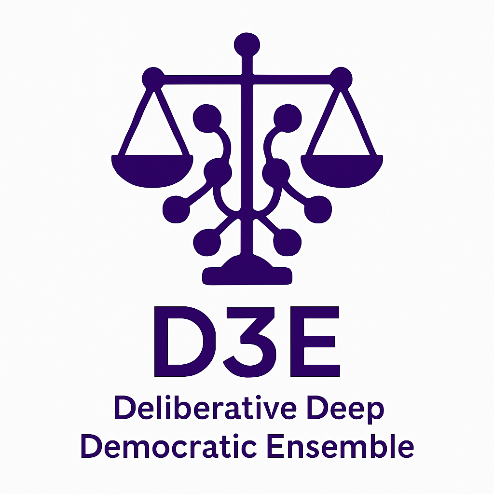

# D3E: Deliberative Deep Democratic Ensemble

**D3E** is a deliberative learning architecture based on legal metaphors. It uses a set of models that play distinct roles in a simulated courtroom — jurors, lawyer, judge, and supreme justice — to promote collective learning, dissent, consensus, and prediction refinement.

---

## 🧠 Deliberative Structure

- **Jurors (3)**: Learn from **lawyer**, are continuously trained to adjust their predictions.
- **Lawyer (1)**: Learns from **supreme justice** using only the raw input data.
- **Judge (1)**: Receives the predictions from the jurors and the lawyer, decides based on their aggregation. - **Supreme Judge (1)**: Ensures the final refinement of the decision using only the raw data. It only ends the process after reaching **sufficient certainty** (low loss and high accuracy).
- **ConfidenceManager**: Regulation system that adjusts the weight of each vote based on the confidence history of each model.

---

## 🔁 Deliberation Process

1. **Raw Input** is passed to all agents, with channel adaptations for each one.
2. The **lawyer** predicts and teaches the **jurors**.
3. The **jurors** are trained and their outputs are combined with that of the **lawyer** to form the **judge**'s vote.
4. The **judge** generates a collegial decision.
5. The **supreme judge** receives only the raw data again and learns from the **judge**'s output. 6. Deliberation continues until there is consensus among 5 of the 6 models with sufficient confidence.

---
## ⚖️ Confidence Module

The `ConfidenceManager` tracks the performance of each model and regulates its voting rights. It:
- Penalizes models with low accuracy.
- Temporarily reduces the influence of "contrarian" models.
- Rehabilitates models that perform well again.

---
## 📊 Visualizations

At each iteration:
- **Images** with individual votes, the consensus map, and the raw input are saved.
- A time-lapse **video** can be generated with an embedded soundtrack.

---
## 📁 Code Structure

- `main.py` – Challenge execution.
- `court_logic.py` – Deliberation and control of learning cycles.
- `confidence_system.py` – Model confidence management.
- `metrics_utils.py` – Visualizations and metrics.
- `SimuV*.py` – Model files with different hierarchical levels.
- `neural_blocks.py` – Reusable neural network components.
- `data_preparation.py` – Data preprocessing.

---

## 🎵 Recommended soundtrack

> 🎧 *"Intergalactic" – Beastie Boys*

To accompany the simulation of a robotic court at war with itself.

---

## 🧪 Tested with

- ARC Challenge tasks `00576224` and `007bbfb7`
- TensorFlow 2.x
- Python 3.10

---

## 📜 License

This project is experimental and deliberately excessive. Use at your own risk. Robotic justice has no jurisprudence.

---

**D3E**: The only neural network that needs a parliamentary recess between epochs.